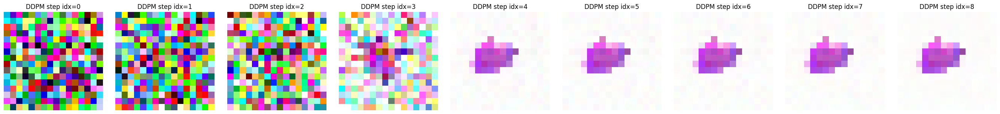

# Diffusion Model for Image Generation

This project implements a diffusion model for generating images, using a U-Net architecture with residual convolution blocks. The model is trained on a custom dataset of 16x16 pixel sprites and is designed to denoise images through a denoising diffusion process.

## Overview

- **Diffusion Model**: A generative model where data is transformed into noise over multiple time steps and then reconstructed through a reverse process.
- **U-Net Architecture**: A convolutional neural network designed for tasks like image segmentation, which is modified for use in the reverse diffusion process.
- **Residual Convolutions**: Used to ensure stable training and improve performance by allowing the model to learn residual mappings between layers.

## Generated Samples

*Examples of images generated by the diffusion model*

