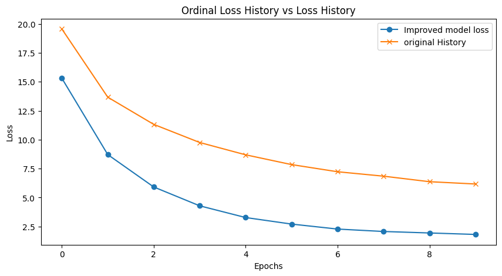

# Improved Denoising Diffusion for Image Data  
This project enhances the method introduced in the paper [*Improving and Unifying Discrete-time and Continuous-time Discrete Denoising Diffusion*](https://arxiv.org/abs/2104.09478) by Lingxiao Zhao et al., specifically by modifying the transition function to make it more suitable for training on image data.

## Key Improvements  
- **Modified Transition Function**: The original transition function was adjusted to better preserve image structure during the diffusion process.
- **Improved Image Generation**: The new transition function leads to more coherent, visually appealing images and better performance on image datasets.
- **Stable Training**: Enhanced the stability and efficiency of training on high-dimensional image data.

## Results  
The modifications result in significantly improved image quality compared to the original model, with generated images that are more consistent and realistic.

## Image Comparisons  

### Original Method
Below is an example of an image generated using the original method. The output lacks some of the finer details and consistency seen in the improved version.

### Improved Method ([Code](https://github.com/curioserve/USD3))
Here's an example of an image generated using the improved method. Notice the enhanced image structure and higher quality compared to the original model.

## Loss Curve  
The following plot shows the training loss curve for the improved model. It demonstrates the stability and efficiency of training with the modified transition function.

## Future Work  
Further investigation could focus on:
- Fine-tuning the transition function for various types of images, including high-resolution data.
- Exploring the impact on other tasks like video generation or text-to-image models.

